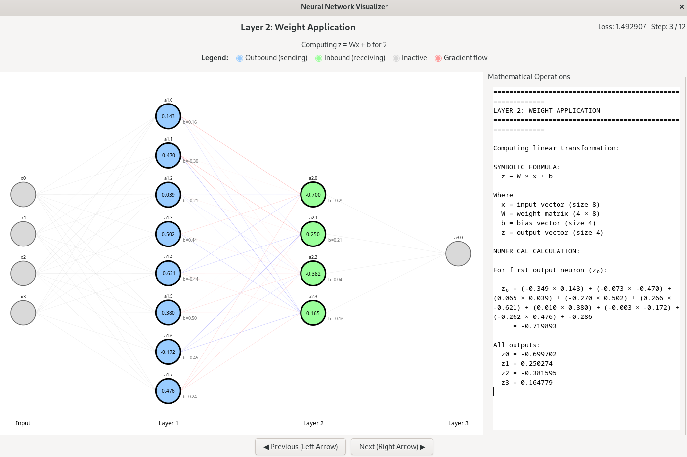
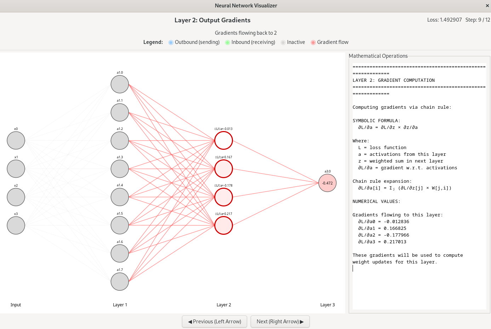

# nn_visualizer
Python tool that uses GTK3 to see the calculatiosn in small torch neural networks.

## Limitations
A limit of 40 neurons was added to ensure visualizations aren't too large.

## Installation
Make sure you have the packages installed.

```
pip install -r requirements.txt
```

## Known issues
I had some issues installing `PyGObject` because gi library 2.0 is not available in the latest stable debian release, so I had to install a `PyGObject` compatible with gi library 1.0.

```
pip install PyGObject==3.46.0
```

## Visualizer description

v3 shows a detailed breakdown of calculations on each layer

## Running it

you can run with `python examples.py`, this will run the demonstration with the 5 examples listed there. You can modify the examples for different visualizations, or add your own.

## Forward propagation example



## Backwards propagation example


